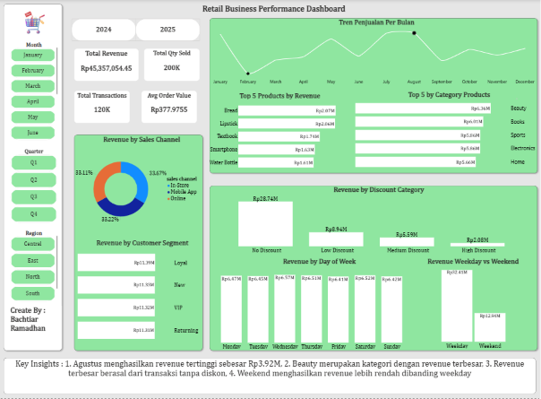

# Retail Sales Analysis Dashboard

## Project Overview

This project analyzes retail sales data to uncover business insights related to sales performance, customer behavior, product categories, sales channels, and discount effectiveness.

The project covers the complete data analysis workflow, including:

- Data Cleaning
- Data Validation
- Feature Engineering
- Exploratory Data Analysis (EDA)
- Interactive Dashboard Development using Power BI

---

## Business Objectives

The main objectives of this analysis are:

- Identify top-performing product categories.
- Analyze monthly sales trends.
- Compare sales performance across regions.
- Evaluate customer segments and purchasing behavior.
- Measure the impact of discount levels on revenue.
- Compare weekday and weekend sales performance.

---

## Tools Used

- SQL (SQLite / DBeaver)
- Power BI
- GitHub

---

## Data Cleaning

The following data cleaning processes were performed:

- Removed unnecessary spaces using `TRIM()`
- Checked and handled missing values
- Checked duplicate transaction IDs
- Validated categorical fields:
  - Category
  - Region
  - Sales Channel
  - Payment Method
- Verified data quality for:
  - Quantity
  - Unit Price
  - Sales Amount

---

## Feature Engineering

Additional columns were created to enhance analysis:

| Feature | Description |
|----------|-------------|
| Year | Transaction Year |
| Month_Num | Month Number (1-12) |
| Month_Name | Month Name |
| Quarter | Quarter (Q1-Q4) |
| Day_Num | Day Order (Monday-Sunday) |
| Day_Name | Day Name |
| Day_Type | Weekday / Weekend |
| Discount_Category | No Discount, Low, Medium, High |

---

## Dashboard Overview

### KPI Metrics

- Total Revenue
- Total Transactions
- Average Order Value (AOV)
- Total Quantity Sold

### Analysis Sections

- Revenue by Month
- Revenue by Product Category
- Revenue by Sales Channel
- Revenue by Customer Segment
- Revenue by Discount Category
- Revenue by Day of Week
- Weekday vs Weekend Performance

---

## Key Insights

### 1. Monthly Performance

- August generated the highest revenue at approximately **Rp3.92M**.

### 2. Product Categories

- Beauty was the highest-performing category in terms of revenue.

### 3. Discount Impact

- Transactions without discounts contributed the largest share of revenue.

### 4. Customer Segments

- Loyal customers generated the highest revenue contribution.

### 5. Sales Timing

- Weekday sales significantly outperformed weekend sales.

---

## Dashboard Preview

---

## Project Outcome

This project demonstrates end-to-end data analytics skills including:

- SQL Data Cleaning
- SQL Feature Engineering
- Exploratory Data Analysis (EDA)
- Data Visualization
- Business Insight Generation
- Dashboard Development

---

## Author

**Bachtiar Ramadhan**

Aspiring Data Analyst passionate about transforming raw data into actionable business insights.
